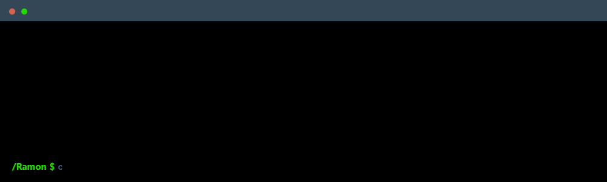

    

 

<h3 align="left">Main skill:</h3>

  <a href="https://skillicons.dev">
    
     
    
  </a>

<h3>My favorite technology:</h3>
  

  

<h3 align="left">I am studying:</h3>

  

<h3 align="left">My Social Media:</h3>

    
    

<h2 align="left">My projects: </h2>
  <ul><li>https://github.com/Speake-oficial</li></ul> 
  

